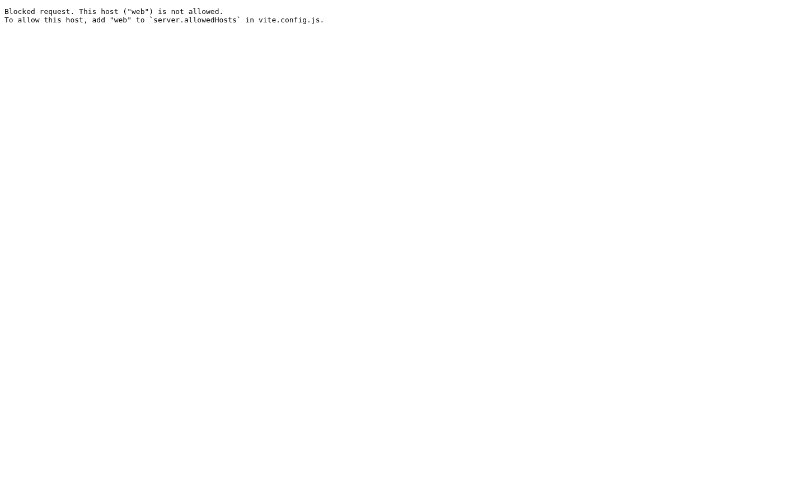
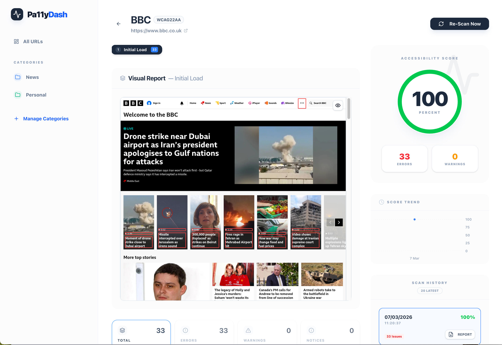
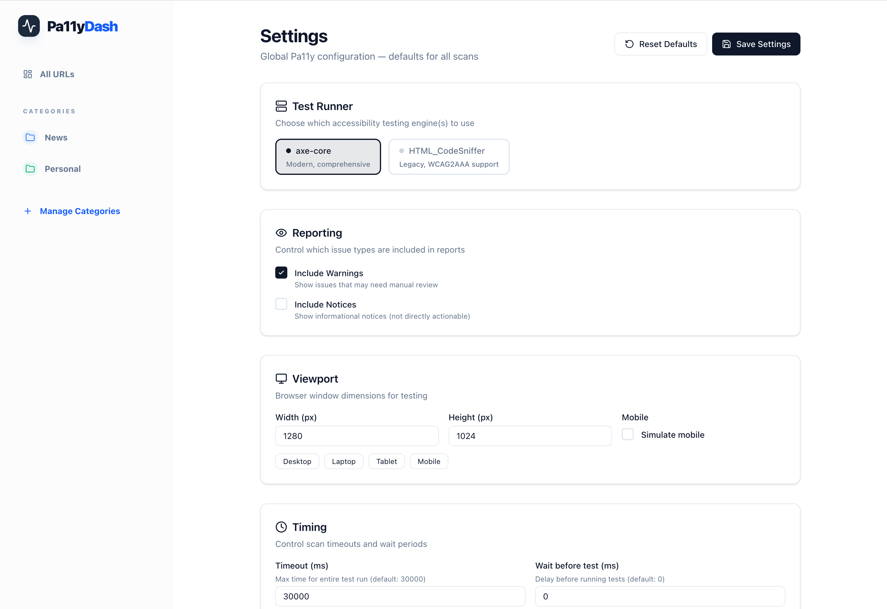

# Pa11y Dashboard NextGen

Pa11y Dashboard NextGen is a modern web interface for the [Pa11y][pa11y] and [Lighthouse][lighthouse] accessibility reporters. It enables teams to monitor accessibility health, track trends over time, and identify issues through interactive reports and scripted user journeys.


[](https://nodejs.org/)
[](LICENSE)

---

## 🚀 Live Demo

**[Try the Live Demo Here!](https://pa11ydash.mangaba.co.uk)**

*Note: The demo environment is secured and runs in "Demo Mode". Background scheduling of scans is disabled to prevent server overload, but you can freely add URLs and trigger manual scans. The database and screenshots are automatically wiped clean every night at 2:00 AM UTC.*

---

## Screenshots


*The main dashboard showing URL cards, statuses, and scores.*


*Detailed accessibility report with multi-step scan results and screenshots.*


*Global configuration for runners, viewports, and scanning rules.*

---

## Key Features

### 📂 Category Management
Organise your monitored URLs into logical groups. NextGen supports rich metadata for categories:
- **Custom Icons**: Choose from a library of semantic icons (Globe, Building, Shopping Cart, etc.).
- **Colour Coding**: Assign distinct colours to categories for quick visual identification.
- **Descriptions**: Add context to why a group of URLs is being monitored together.
- **Filtering**: Sidebar navigation allows you to quickly isolate URLs by category.

### ⚙️ Global & Per-URL Configuration
Fine-tune your accessibility scans at any level:
- **Global Defaults**: Set organisation-wide standards for runners (Axe vs HTMLCS), viewports, and ignore rules.
- **Per-URL Overrides**: Override any global setting for a specific URL. Useful for sites that require longer timeouts or specific viewports.
- **Custom Headers**: Add authentication tokens or cookies to test pages behind login screens.
- **Element Control**: Hide specific CSS selectors (such as moving carousels) or limit testing to a "Root Element".

### 🎭 Scripted Multi-Step Actions
Test complex user journeys, not just landing pages. The script editor supports:
- **`click`**: Interact with buttons, tabs, or menus. Supports piercing iframes with `iframe_selector >>> element_selector`.
- **`type`**: Fill out forms (e.g. login, search). Supports iframes with `iframe_selector >>> element_selector|text`.
- **`wait`**: Pause for a specific duration to allow animations to finish.
- **`wait-for-url`**: Synchronise with navigation events.
- **Interactive Reports**: Each step generates its own score and screenshot, allowing you to pinpoint exactly where accessibility degrades in a user flow.

### 📄 Standalone HTML Export
Generate and share professional accessibility reports with stakeholders.
- **Self-Contained**: Reports follow the WCAG-EM structure and include all necessary context.
- **Actionable**: Includes code snippets, selectors, and specific fix suggestions for every issue.
- **Visual Evidence**: Automatically embeds focused screenshots of the problematic elements.

### 📈 Visual Intelligence
- **Trend Charts**: Interactive Recharts-powered graphs show accessibility health over time.
- **Focused Issue Snippets**: NextGen automatically crops the page screenshot around each identified issue. You can see the exact problematic element directly in the issue list and exported reports.
- **Screenshot Overlays**: Maps Pa11y issues directly onto full-page screenshots. Click an issue in the list to see exactly where it is on the page.
- **Hybrid Scoring**: Combines Lighthouse's industry-standard metrics with a custom rule-based algorithm for intermediate scripted steps.

---

## NextGen vs. Original Pa11y Dashboard

| Feature | Original Pa11y Dashboard | NextGen (This Project) |
|---------|-------------------------|------------------------|
| **Framework** | Express / EJS | Fastify / React 19 |
| **Language** | JavaScript | 100% TypeScript |
| **Styling** | Custom LESS / CSS | Tailwind CSS 4.2 |
| **Testing** | Mocha / Should | Vitest / React Testing Library |
| **Scoring** | Issue counting | Hybrid Lighthouse + Weighted Rules |
| **Visuals** | Static reports | Interactive Charts & Screenshot Pins |
| **Speed** | Standard execution | Concurrent Scheduler |
| **Scripting** | Text-based actions | Interactive UI Script Editor |

---

## Scoring Algorithm

Pa11y Dashboard NextGen uses a hybrid scoring system to provide accurate and meaningful accessibility metrics:

### 1. Initial Load (Lighthouse)
For the first page load, we use the official **Lighthouse Accessibility Score** (0-100). This is an industry standard and covers a wide range of automated checks.

### 2. Multi-Step Actions (Custom Algorithm)
Since Lighthouse typically requires a full page reload, intermediate steps use a **Custom Rule-Based Deduction Algorithm** based on Pa11y/Axe results:

- **Base Score**: 100 points.
- **Unique Rule Deductions**: Points are deducted based on the *severity* of unique rules that failed, rather than the total number of issues. This prevents repetitive errors from zeroing out the score.
  - **Critical**: -15 points
  - **Serious**: -8 points
  - **Moderate**: -4 points
  - **Minor**: -1 point
- **Instance Penalty**: A small penalty of **0.1 points** is applied for every individual issue instance (capped at 20 points total) to reflect the scale of the problem.

### 3. Overall Scan Score
The final score displayed for a multi-step scan is the **average score** of all successful steps.

## Requirements

- [Node.js][node]: Pa11y Dashboard NextGen requires Node.js 24 or above.
- [MongoDB][mongodb]: This project stores test results in a MongoDB database.
- [Docker][docker] (Optional): Recommended for simplified setup and deployment.

## Running the Application

### Local Development (Using Docker)
The easiest way to get started is with Docker Compose:
```bash
docker-compose up -d
```
- **Dashboard**: [http://localhost:8080](http://localhost:8080)
- **API**: [http://localhost:3000](http://localhost:3000)

### Production Deployment (Recommended)
For production, we recommend a unified Docker build where the backend serves the frontend assets. This is optimised for environments like Oracle Cloud.

👉 **[View the Oracle Cloud Deployment Guide](ORACLE_CLOUD_DEPLOYMENT.md)**

### Manual Installation
1. **Clone the repository**:
   ```bash
   git clone https://github.com/igordutra/pa11y-dashboard-nextgen.git
   ```

2. **Install dependencies**:
   ```bash
   cd client && npm install
   cd ../server && npm install
   ```

3. **Configure environment**:
   Create a `.env` file in the `server` directory (see [Configuring](#configuring-pa11y-dashboard-nextgen)).

4. **Run the application**:
   - **Backend**: `cd server && npm run dev`
   - **Frontend**: `cd client && npm run dev`

## Testing

We use [Vitest](https://vitest.dev/) for both frontend and backend testing.

### Server Tests
```bash
cd server
npm run test
```

### Client Tests
```bash
cd client
npm run test
```

## API Documentation

The API includes built-in Swagger documentation. When the server is running, visit:
`http://localhost:3000/documentation`

## Configuring Pa11y Dashboard NextGen

Configuration is managed via environment variables in the `server` directory.

### `PORT`
*(number)* The port to run the API on (defaults to `3000`).

### `MONGO_URI`
*(string)* The MongoDB connection string.

### `CLIENT_URL`
*(string)* The URL of the frontend application (required for CORS).

### `DEMO_MODE`
*(boolean)* Set to `true` to disable background scheduling and enable UI warnings.

## Contributing

Contributions are welcome! Please see [CONTRIBUTING.md](CONTRIBUTING.md) for details.

1. **Fork the repository**.
2. **Create a feature branch**: `git checkout -b feature/your-feature`.
3. **Submit a Pull Request**.

## Troubleshooting

- **MongoDB Connection**: Ensure MongoDB is running. If using Docker, check `docker-compose logs mongo`.
- **Puppeteer/Chrome**: On Linux, ensure all Chromium dependencies are installed (included in our Dockerfiles).

## License

Pa11y Dashboard NextGen is licensed under the [MIT License](LICENSE).

[node]: http://nodejs.org/
[mongodb]: http://www.mongodb.org/
[pa11y]: https://github.com/pa11y/pa11y
[lighthouse]: https://developers.google.com/web/tools/lighthouse
[docker]: https://www.docker.com/
