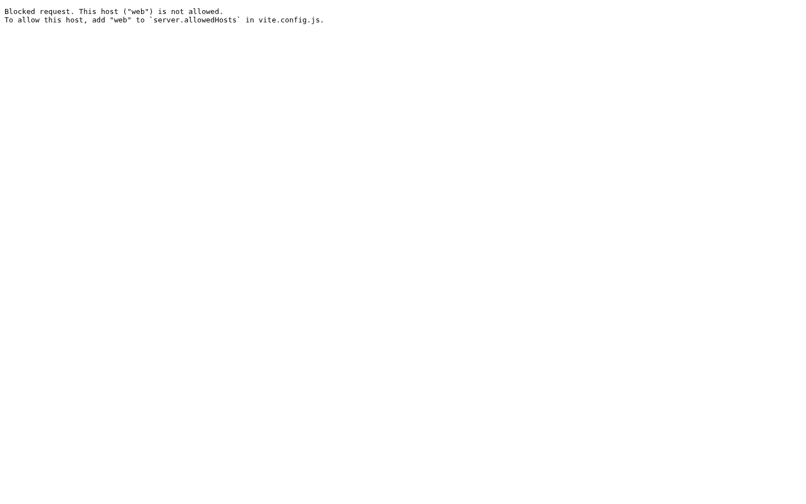
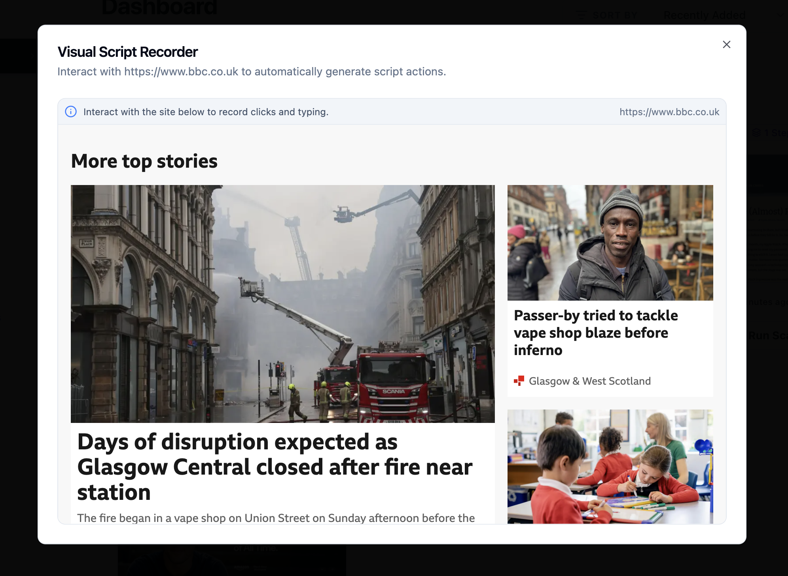

# Pa11y Dashboard NextGen

Pa11y Dashboard NextGen is a modern web interface for the [Pa11y][pa11y] and [Lighthouse][lighthouse] accessibility reporters. It enables teams to monitor accessibility health, track trends over time, and identify issues through interactive reports and scripted user journeys.

This project was built and evolved with the assistance of **Gemini CLI**, an AI-powered agent for software engineering.


[](https://nodejs.org/)
[](LICENSE)

---

## 🚀 Live Demo

**[Try the Live Demo Here!](https://pa11ydash.mangaba.co.uk)**

*Note: The demo environment is secured and runs in "Demo Mode". Background scheduling of scans is disabled to prevent server overload, but you can freely add URLs and trigger manual scans. The database and screenshots are automatically wiped clean every night at 2:00 AM UTC.*

---

## Screenshots


*The main dashboard showing URL cards, statuses, and scores.*

 
*Analytics Dashboard providing a high-level overview of accessibility health.*


*The Visual Script Recorder allows users to point, click, and type to generate complex interaction scripts.*


*Real-time visibility into active scans, wait lists, and failure history.*

---

## Key Features

### 🎬 Visual Script Recorder
Creating scripts for multi-step audits has never been easier. Instead of manually finding CSS selectors:
- **Interactive Proxy**: The dashboard securely loads the target site in an embedded visual recorder.
- **Point & Click**: Simply click buttons, open menus, and type into forms. The recorder automatically generates the optimized CSS selectors and Pa11y action blocks.
- **Multi-Page Journeys**: Follow links to navigate through your site naturally; the recorder automatically inserts `wait-for-url` synchronization points.
- **Smart Merging**: The backend scanning engine merges interaction steps with navigation steps to produce clean, clutter-free accessibility reports.

### 📊 Real-time Job Monitoring
Get complete visibility into the background scanning engine:
- **Active Scans**: Monitor currently running audits and their execution duration.
- **Wait List**: See exactly how many URLs are queued and their relative priority.
- **Scheduled Tasks**: View a comprehensive list of all recurring scans with human-readable frequencies and "Next run" predictions.
- **Failure History**: A detailed log of the last 50 scan errors with descriptive failure reasons and timestamps for easier troubleshooting.

### ⚙️ Global & Per-URL Configuration
Fine-tune your accessibility scans at any level:
- **Global Defaults**: Set organisation-wide standards for runners (Axe vs HTMLCS), viewports, and ignore rules.
- **Configurable Concurrency**: Adjust the system load by controlling how many scans run simultaneously (1-10) via the Settings page.
- **Per-URL Overrides**: Override any global setting for a specific URL. Useful for sites that require longer timeouts or specific viewports.
- **Custom Headers**: Add authentication tokens or cookies to test pages behind login screens.

### 📂 Category Management
Organise your monitored URLs into logical groups. NextGen supports rich metadata for categories:
- **Custom Icons**: Choose from a library of semantic icons (Globe, Building, Shopping Cart, etc.).
- **Colour Coding**: Assign distinct colours to categories for quick visual identification.
- **Filtering**: Sidebar navigation allows you to quickly isolate URLs by category.

### 🔐 Authentication & RBAC
Secure your dashboard with enterprise-grade authentication:
- **Local Auth**: Secure email/password login with bcrypt hashing.
- **Role-Based Access Control (RBAC)**: Fine-grained permissions with `admin`, `editor`, and `viewer` roles.
- **GitHub OAuth**: Single-sign-on support via GitHub.
- **Setup CLI**: Simple bootstrap process to create the first admin user and generate secrets.
- **Stateless Session**: JWT-based session management for high scalability and security.

### 🎭 Scripted Multi-Step Actions
Test complex user journeys, not just landing pages. The script editor supports:
- **`click`**: Interact with buttons, tabs, or menus. Supports piercing iframes with `iframe_selector >>> element_selector`.
- **`type`**: Fill out forms (e.g. login, search). Supports iframes with `iframe_selector >>> element_selector|text`.
- **`wait`**: Pause for a specific duration to allow animations to finish.
- **`wait-for-url`**: Synchronise with navigation events.
- **Interactive Reports**: Each step generates its own score and screenshot, allowing you to pinpoint exactly where accessibility degrades in a user flow.

### 📄 Standalone HTML Export
Generate and share professional accessibility reports with stakeholders.
- **Self-Contained**: Reports follow the WCAG-EM structure and include all necessary context.
- **Actionable**: Includes code snippets, selectors, and specific fix suggestions for every issue.
- **Visual Evidence**: Automatically embeds focused screenshots of the problematic elements.

### 📉 Visual Intelligence
- **Analytics Dashboard**: A high-level overview providing deep insights into accessibility performance across all monitored targets. Includes historical trends, issue severity breakdowns, top violations, and category performance.
- **High-Impact Dashboard**: Modern URL cards with circular accessibility score gauges and relative "Last scan" times.
- **Smart Sorting**: Sort your monitored targets by Recently Added, Name (A-Z), or Accessibility Score (Lowest First) to prioritise remediation efforts.
- **Trend Charts**: Interactive Area-style graphs with blue gradients and subtle axis lines showing accessibility health over time.
- **Focused Issue Snippets**: NextGen automatically crops the page screenshot around each identified issue. You can see the exact problematic element directly in the issue list and exported reports.
- **Screenshot Overlays**: Maps Pa11y issues directly onto full-page screenshots with scrollable viewports for long pages.
- **Integrated Filters**: One-click filtering for Errors, Warnings, and Notices directly integrated into the issues list.
- **Hybrid Scoring**: Combines Lighthouse's industry-standard metrics with a custom rule-based algorithm for intermediate scripted steps.

---

## NextGen vs. Original Pa11y Dashboard

| Feature | Original Pa11y Dashboard | NextGen (This Project) |
|---------|-------------------------|------------------------|
| **Framework** | Express / EJS | Fastify / React 19 |
| **Language** | JavaScript | 100% TypeScript |
| **Styling** | Custom LESS / CSS | Tailwind CSS 4.2 |
| **Testing** | Mocha / Should | Vitest / React Testing Library |
| **Scoring** | Issue counting | Hybrid Lighthouse + Weighted Rules |
| **Visuals** | Static reports | Interactive Charts & Screenshot Pins |
| **Speed** | Standard execution | Configurable Concurrency |
| **Monitoring** | None | Real-time Job Queue & Failure History |
| **Analytics** | None | High-level Dashboard & Trend Analysis |
| **Scripting** | Text-based actions | Interactive UI Script Editor |

---

## Scoring Algorithm

Pa11y Dashboard NextGen uses a hybrid scoring system to provide accurate and meaningful accessibility metrics:

### 1. Initial Load (Lighthouse)
For the first page load, we use the official **Lighthouse Accessibility Score** (0-100). This is an industry standard and covers a wide range of automated checks.

### 2. Multi-Step Actions (Custom Algorithm)
Since Lighthouse typically requires a full page reload, intermediate steps use a **Custom Rule-Based Deduction Algorithm** based on Pa11y/Axe results:

- **Base Score**: 100 points.
- **Unique Rule Deductions**: Points are deducted based on the *severity* of unique rules that failed, rather than the total number of issues. This prevents repetitive errors from zeroing out the score.
  - **Critical**: -15 points
  - **Serious**: -8 points
  - **Moderate**: -4 points
  - **Minor**: -1 point
- **Instance Penalty**: A small penalty of **0.1 points** is applied for every individual issue instance (capped at 20 points total) to reflect the scale of the problem.

### 3. Overall Scan Score
The final score displayed for a multi-step scan is the **average score** of all successful steps.

## Security

Pa11y Dashboard NextGen includes several built-in security features:

### 🛡️ XSS Prevention
All dynamic content, including URL names, target URLs, and scanner error messages, is automatically HTML-escaped before being rendered in the dashboard or exported in HTML reports.

### 🚦 API Rate Limiting
To prevent abuse and potential Denial of Service (DoS) attacks, the API implements global rate limiting.
- **Global Limit**: 100 requests per minute per IP.
- **Scan Triggers**: Stricter limit of 2 manual scan triggers per minute per IP to prevent resource exhaustion.

### 🛡️ SSRF Protection
The Visual Script Recorder's interactive proxy includes built-in protection against Server-Side Request Forgery (SSRF). It automatically validates target URLs and blocks access to local (localhost, 127.0.0.1) and private IP ranges (10.x.x.x, 192.168.x.x, etc.) to ensure the dashboard cannot be used to probe internal network infrastructure.

### 📦 Puppeteer Sandboxing
The scanning engine runs Puppeteer with the built-in sandbox enabled for better process isolation. If your environment does not support sandboxing (e.g., some restricted CI environments), you can explicitly disable it by setting `PUPPETEER_NO_SANDBOX=true`.

### 🎭 Demo & Read-Only Mode
When `DEMO_MODE=true` is set:
- **Background Scheduling**: Automatically disabled.
- **Modifications**: All `POST`, `PUT`, and `DELETE` operations are blocked (returning `403 Forbidden`).
- **UI Feedback**: The dashboard displays a "Demo Mode" banner and disables all mutation buttons.

## Requirements

- [Node.js][node]: Pa11y Dashboard NextGen requires Node.js 24 or above.
- [MongoDB][mongodb]: This project stores test results in a MongoDB database.
- [Docker][docker] (Optional): Recommended for simplified setup and deployment.

## Running the Application

### Local Development (Using Docker)
The **preferred** way to get started is using Docker, which provides a full environment with **hot-reloading** for both the frontend and backend:

```bash
# Start the full environment
npm run dev

# View logs
npm run logs

# Run tests inside Docker
npm run docker:test
```

Alternatively, you can run services manually for debugging or if Docker is unavailable (ensure MongoDB is running):
1. **Clone the repository**:
   ```bash
   git clone https://github.com/igordutra/pa11y-dashboard-nextgen.git
   ```

2. **Install dependencies**:
   ```bash
   cd client && npm install
   cd ../server && npm install
   ```

3. **Configure Authentication**:
   The dashboard requires an initial setup to create an admin user and generate a JWT secret:
   ```bash
   cd server
   npm run setup-auth
   ```
   Follow the prompts to create your admin account. The script will output a `JWT_SECRET` and `AUTH_ENABLED=true` which you must add to your `.env` file in the `server` directory.

4. **Configure environment**:
   Create a `.env` file in the `server` directory (see [Configuring](#configuring-pa11y-dashboard-nextgen)).

5. **Run the application**:
   - **Backend**: `cd server && npm run dev`
   - **Frontend**: `cd client && npm run dev`

## Testing

We use [Vitest](https://vitest.dev/) for both frontend and backend testing.

### Server Tests
```bash
cd server
npm run test
```

### Client Tests
```bash
cd client
npm run test
```

## API Documentation

The API includes built-in Swagger documentation. When the server is running, visit:
`http://localhost:3000/documentation`

## Configuring Pa11y Dashboard NextGen

Configuration is managed via environment variables in the `server` directory.

### `PORT`
*(number)* The port to run the API on (defaults to `3000`).

### `MONGO_URI`
*(string)* The MongoDB connection string.

### `CLIENT_URL`
*(string)* The URL of the frontend application (required for CORS).

### `NODE_ENV`
*(string)* Set to `development` for local work or `production` for deployment.

### `SCREENSHOTS_DIR`
*(string)* Path where scan screenshots are stored (defaults to `./screenshots`).

### `DEMO_MODE`
*(boolean)* Set to `true` to disable background scheduling, enable UI warnings, and enforce read-only mode for all mutations.

### `READONLY`
*(boolean)* Set to `true` to disable all modifications without the "Demo Mode" banner. Defaults to `true` if `DEMO_MODE=true`.

### `AUTH_ENABLED`
*(boolean)* Set to `true` to enable the authentication layer. Requires `JWT_SECRET`.

### `JWT_SECRET`
*(string)* A strong random string used to sign JWT tokens. Can be generated using the setup script or manually.

### `GITHUB_CLIENT_ID` / `GITHUB_CLIENT_SECRET`
*(string)* Optional credentials for GitHub OAuth integration.

### `PUPPETEER_NO_SANDBOX`
*(boolean)* Set to `true` to disable the Puppeteer sandbox (only use if sandboxing is not supported by your OS/environment).

### `PUPPETEER_EXECUTABLE_PATH`
*(string)* Optional path to a specific Chromium/Chrome executable. Required in our Docker images.

## Contributing

Contributions are welcome! Please see [CONTRIBUTING.md](CONTRIBUTING.md) for details.

1. **Fork the repository**.
2. **Create a feature branch**: `git checkout -b feature/your-feature`.
3. **Submit a Pull Request**.

## Troubleshooting

- **MongoDB Connection**: Ensure MongoDB is running. If using Docker, check `docker-compose logs mongo`.
- **Puppeteer/Chrome**: On Linux, ensure all Chromium dependencies are installed (included in our Dockerfiles).

## Acknowledgements

A special thank you to the [Pa11y project](https://github.com/pa11y) and its incredible community for providing the foundations and inspiration for this dashboard.

## License

Pa11y Dashboard NextGen is licensed under the [MIT License](LICENSE).

[node]: http://nodejs.org/
[mongodb]: http://www.mongodb.org/
[pa11y]: https://github.com/pa11y/pa11y
[lighthouse]: https://developers.google.com/web/tools/lighthouse
[docker]: https://www.docker.com/
